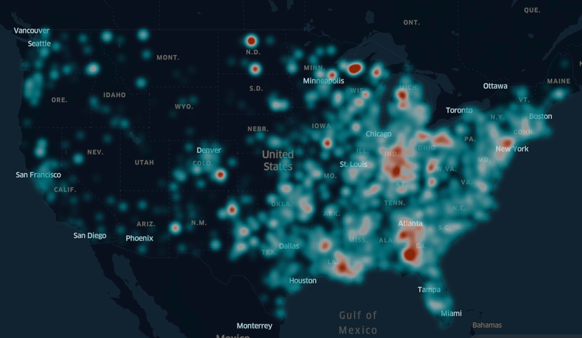

# US COVID-19 Time-Series Heat Map

This project aims to build a data visualization of time-series COVID-19 death rate at US county level using [kepler.gl](https://kepler.gl/demo).

## Description of Contents

* `data`:
  * **us-counties.csv**: US COVID-19 dataset at county level (as of 07/22/2021)
  * **cb_2018_us_county_500k.shp**: 2018 US county boundary
  * **cb_2018_us_state_500k.shp**: 2018 US state boundary
* `src`:
  * **us_counties_by_month.py**: a python script to create US COVID-19 monthly death rate by county and state.
* `output`:
  * **COVID-19 US_County_monthly.csv**: an output csv that is ready for data visualization using kepler.gl.
* `viz`:
  * **COVID-19_Death_Rate_Heat_Map.html**: heat map visualization in html format.
  * **viz_screenshot.png**: a project sreenshot.

## Project Screenshot

